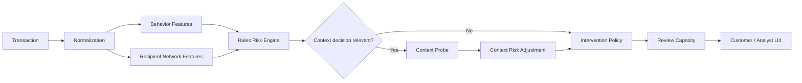

# AegisPay

**Intent-Aware Adaptive Scam Intervention for Mobile Financial Services**

AegisPay is a Django-based prototype for deciding not only whether a payment
looks risky, but what should happen next. It combines transaction behavior,
recipient-network evidence, one selectively acquired customer context signal,
proportionate intervention selection, and constrained human review. The
current evidence is a deterministic synthetic benchmark, not production
validation.

## The Problem

Conventional payment-risk systems can identify suspicious transactions while
leaving a second operational question unanswered: **what should happen next?**
Allowing a risky transfer can expose customers to loss; warning every unusual
payment creates legitimate-user friction; irrelevant questions waste attention;
manual review is capacity-constrained; and unnecessarily strong interventions
can damage trust.

AegisPay treats intervention selection as part of the decision. It aims to
acquire only decision-relevant context and choose the minimum effective action
under transparent prototype assumptions.

## Our Approach

```text
Transaction
→ Behavioral intelligence
→ Recipient-network intelligence
→ Rules-based risk assessment
→ Decision-Relevant Context Probe, only when useful
→ Context-aware risk update
→ Minimum-effective intervention
→ Capacity-aware review
```

The Context Probe is selective. AegisPay does not ask every customer an extra
question. If an answer cannot change the eligible intervention or the decision
is already sufficiently supported by evidence, the probe is skipped.

## What Makes AegisPay Different

The prototype integrates:

- sender and transaction behavior evidence;
- beneficiary-network evidence;
- selective context acquisition;
- adaptive intervention selection;
- constrained review capacity;
- transparent rules and explanations;
- controlled synthetic validation across seeds, mixtures, friction, and
  intervention assumptions.

The prototype contribution is the MFS-specific integration of these mechanisms
into one adaptive decision pipeline. No individual component is presented as
world-first or novel in isolation.

## Intervention Ladder

The policy evaluates these supported actions:

1. **Allow** — continue when risk is low and no stronger action is justified.
2. **Contextual Warning** — add proportionate recipient or payment guidance.
3. **Scam Warning** — present stronger scam-oriented caution.
4. **Verify** — require an additional verification step in the prototype flow.
5. **Cooling Period** — pause the payment under stronger risk assumptions.
6. **Human Review** — request constrained analyst review.

“Minimum-effective intervention” means selecting the eligible action with the
lowest modeled total harm: residual expected loss plus legitimate-user
friction and operations cost. These protection and cost values are prototype
assumptions, not measured economics.

## Decision-Relevant Context Probe

Example:

```text
Existing evidence:
new recipient + unusual amount + recent device change

Question:
Does the person guiding this payment claim to represent a bank or financial service?

If the answer can change the intervention:
ask it.

If it cannot:
skip it.
```

The canonical runtime service asks at most one targeted question before
intervention selection. A positive answer changes context-adjusted risk; a
negative answer does not erase objective transaction or network evidence.

## Architecture



See [docs/ARCHITECTURE.md](docs/ARCHITECTURE.md) for module boundaries,
data boundaries, lifecycle details, and the leakage boundary.

## Product Experience

### Customer

The customer demo supports payment initiation, a selective customer-facing
**Security Check**, proportionate intervention messaging, and simulated
completion/protection states. No payment is executed or persisted.

### Analyst

The analyst experience includes:

- overview and review-capacity summary;
- transaction-level explainability;
- recipient-network intelligence and native SVG graph interaction;
- curated experiment evidence and validation scope.

## Demo Routes

```text
/                              → analyst entry
/demo/                         → customer demo alias
/dashboard/                    → risk overview
/dashboard/demo/payment/       → customer payment demo
/dashboard/transactions/TX-8420/ → transaction explanation
/dashboard/network/            → network intelligence
/dashboard/experiments/        → validation evidence
```

The customer scenario selector includes:

- **Normal payment** — no unnecessary security friction;
- **Guided / impersonation risk** — one decision-relevant question changes the
  intervention;
- **Strong evidence** — no unnecessary question when evidence is already
  sufficient.

## Reference Demonstration

Controlled configuration: **600 scenarios**, **seed 42**, **review capacity
20**.

| Metric | Legacy Probe | Decision-Relevant Probe |
|---|---:|---:|
| Probe count | 525 | 360 |
| Probe rate | 87.50% | 60.00% |
| Simulated prevention | 30.93% | 37.60% |
| Residual scam loss | 705343.30 | 637291.80 |
| Legitimate total friction | 27990.00 | 26215.00 |
| Allocated reviews | 3 | 14 |
| Modeled total cost | 761733.30 | 711376.80 |

The higher review demand, **3 → 14**, is an explicit trade-off. Modeled costs
are unitless prototype accounting values, not currency.

## Robustness Experiments

### EXP-01 — Seed × Review Capacity

EXP-01 covers five seeds (`7, 21, 42, 84, 126`) and five capacities
(`0, 5, 10, 20, 40`): **25 controlled comparisons**. The candidate had fewer
probes, better prevention, lower modeled cost, and lower legitimate friction in
**25/25** cells, with no review-capacity violations. Review demand was higher
for the candidate at larger capacities.

### EXP-02 — Scenario-Mixture Sensitivity

EXP-02 contains **50 controlled cells** across:

- EQUAL_FAMILY;
- LEGITIMATE_DOMINANT;
- HARD_NEGATIVE_DOMINANT;
- SOCIAL_ENGINEERING_HEAVY;
- NETWORK_ABUSE_HEAVY.

The candidate had fewer probes, better prevention, lower friction, and lower
modeled cost in **50/50** cells. These benchmark weights are synthetic stress
assumptions, not prevalence estimates.

### EXP-03A — Probe-Friction Sensitivity

Probe-cost assumptions are `0, 10, 25, 50, 100, 200`. The canonical strategy
had lower modeled total cost at all six tested points: there was no modeled-cost
sign reversal. Probe cost is evaluation/accounting input here; it does not
change runtime policy decisions.

### EXP-03B — Intervention-Assumption Sensitivity

EXP-03B contains **7 assumption profiles**, **50 controlled cells per profile**,
**350 controlled cells globally**, and **700 strategy runs**.

Global directional results:

- fewer probes: **350/350**;
- prevention better: **350/350**;
- legitimate friction lower: **350/350**;
- modeled cost lower: **350/350**.

These are synthetic benchmark comparisons under modeled intervention
assumptions, not production effectiveness claims.

Detailed evidence and scope definitions are in
[docs/VALIDATION.md](docs/VALIDATION.md) and the dashboard at
`/dashboard/experiments/`.

## Data & Evaluation

The current evaluation uses deterministic synthetic scenarios from these
families:

`LEGITIMATE`, `ACCOUNT_TAKEOVER`, `IMPERSONATION`, `ADVANCE_FEE`,
`MULE_RECIPIENT`, `RAPID_CASHOUT`, `LEGITIMATE_UNUSUAL`, and
`LEGITIMATE_NETWORK_HUB`.

`is_scam` and scenario type are evaluation-only metadata. They never enter
runtime risk scoring, Context Probe selection, graph-risk logic, intervention
selection, or customer decisions.

## Responsible AI / Safety

- No autonomous permanent wallet freeze is implemented.
- Human review is constrained and capacity-aware.
- Customer questioning is selective rather than universal.
- Negative Context Probe answers do not erase objective evidence.
- Explanations expose rules and evidence rather than pretending to be a
  black-box model explanation.
- Ground truth remains evaluation-only.
- Results are synthetic prototype evidence.

## Limitations

This repository does not claim:

- validation on real MFS or upay transaction data;
- that scenario mixtures represent population prevalence;
- measured protection effectiveness;
- measured customer friction or operations cost;
- observed customer behavior;
- a production analyst workload study;
- production payment or authentication integration;
- real payment execution;
- production fraud reduction;
- an ML model in the current validated pipeline.

The current validated prototype intentionally prioritizes a transparent
rules/network/context/intervention pipeline. ML remains future work rather
than an unvalidated submission claim.

## Tech Stack

- Python 3.14
- Django 6.1.1
- SQLite
- NetworkX 3.7
- Django templates
- CSS
- Repository-owned JavaScript and SVG

## Project Structure

```text
config/          Django settings and project URLs
core/            Typed runtime and evaluation contracts
transactions/    Persistence, normalization, and behavior enrichment
network/         Historical recipient/network features
risk/            Transparent deterministic risk engine
interventions/  Context, policy, portfolio, and review capacity services
experiments/     Synthetic generators, runners, comparisons, and tests
dashboard/       Analyst/customer UI, presenters, static assets, evidence
docs/            Architecture, validation, demo, and submission documents
```

## Local Setup

```bash
python -m venv .venv
source .venv/bin/activate
pip install -r requirements.txt
python manage.py migrate
python manage.py runserver
```

Open `http://127.0.0.1:8000/`. The repository was validated with the project
virtual environment using `.venv/bin/python`.

## Temporary Render Deployment

This repository can be deployed temporarily as a single Render Web Service.
The service uses the existing Django WSGI application and SQLite for the
hackathon demo.

- **Build command:** `./build.sh`
- **Start command:** `gunicorn config.wsgi:application`
- **Configured environment variables:** Render-generated `SECRET_KEY` and
  `DEBUG=False`

The Django settings automatically consume Render's
`RENDER_EXTERNAL_HOSTNAME` and `RENDER_EXTERNAL_URL` values for host
validation and HTTPS CSRF trusted origins. No hostname copy or manual
redeploy step is required.

To deploy:

1. Push the repository to GitHub.
2. In Render, choose **New → Blueprint**.
3. Connect `asifelahii/aegispay`.
4. Apply the Blueprint.
5. Wait for the deployment to complete.
6. Open the generated `.onrender.com` URL.

Render generates `SECRET_KEY` through the blueprint; do not replace it with a
committed value.

SQLite is intentionally temporary and ephemeral for this public demo. A
proper deployment should move durable data to PostgreSQL later.

## Testing

```bash
python manage.py test
python manage.py check
python manage.py makemigrations --check
```

The current validated suite contains **269 tests**. See
[docs/DEMO_GUIDE.md](docs/DEMO_GUIDE.md) for a timed presentation path and
fallback URLs.

## Future Work

Potential next steps include real MFS data validation, calibrated ML ranking
when justified by governed data, external validation, richer graph models,
production review workflow, and a longitudinal customer-friction study. None
of these are represented as implemented functionality or current evidence.
