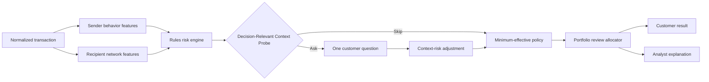
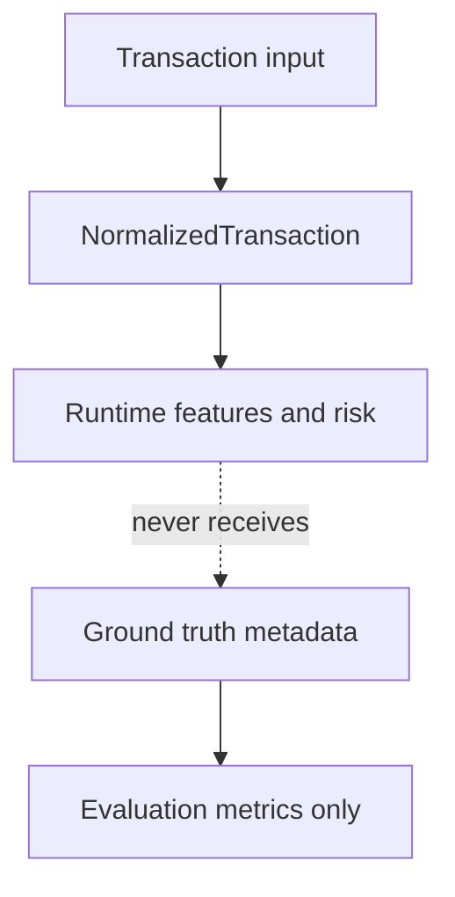
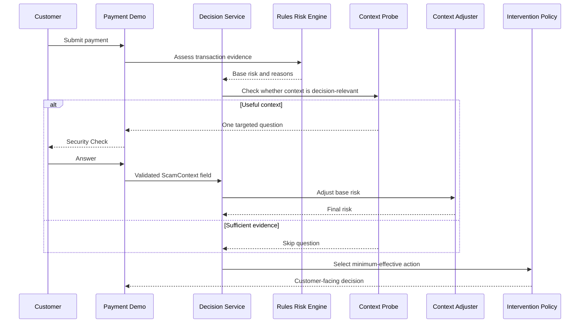

# AegisPay Architecture

## Purpose

AegisPay is a Django-first modular monolith that turns transaction and
recipient evidence into a proportionate intervention decision. The design
keeps customer context selective, policy assumptions explicit, review capacity
constrained, and explanations inspectable.

## Runtime Pipeline



The default `AegisPayDecisionService` uses
`DecisionRelevantContextProbeService`. The historical legacy probe remains
explicitly injectable for controlled comparisons; it is not the canonical
runtime default.

## Module Responsibilities

| Module | Responsibility |
|---|---|
| `core` | Frozen dataclass/enum contracts such as transactions, risk bands, context, actions, and evaluation-only ground truth |
| `transactions` | Django persistence, normalization, sender behavior enrichment, and feature coordination |
| `network` | Historical recipient/network features using pre-transaction windows and NetworkX-compatible graph semantics |
| `risk` | Transparent deterministic rules risk engine and reason contributions |
| `interventions` | Context Probe, context adjustment, intervention policy, portfolio flow, and review-capacity allocation |
| `experiments` | Synthetic scenario generation, baselines, controlled comparisons, sensitivity runs, and diagnostics |
| `dashboard` | Thin Django views, presenters, templates, CSS, SVG/JavaScript, and curated evidence presentation |

## Data Boundaries

Runtime decisions receive `NormalizedTransaction`, derived behavior/network
features, optional `ScamContext`, and policy configuration. The policy does not
receive `TransactionGroundTruth`.

`TransactionGroundTruth` contains `is_scam` and optional scenario metadata for
training/evaluation analysis only. It is deliberately separate from runtime
transaction evidence.



## Leakage Boundary

Scenario labels and `is_scam` are never inputs to risk scoring, Context Probe
selection, network-risk logic, intervention selection, or customer decisions.
The experiment runner may join runtime outcomes with ground truth after a
decision for evaluation metrics.

## Network Feature Derivation

`RecipientNetworkFeatureService` uses only transactions before the transaction
being analyzed:

- unique senders in the preceding 24 hours;
- weighted fan-in in the preceding 24 hours;
- weighted fan-out in the preceding 24 hours;
- outgoing/incoming value pass-through ratio, capped at `1.0`;
- cash-out/incoming value during the preceding hour, capped at `1.0`.

The dashboard network page is a deterministic presentation scenario derived
from equivalent event data. It does not imply future-event access or create
new detection logic.

## Context Probe Lifecycle



At most one probe interaction occurs in the v0 flow. A negative answer does
not delete objective evidence; it only avoids adding affirmative context.

## Intervention Selection

`MinimumEffectiveInterventionPolicy` filters actions by risk-band minimum
protection and evaluates:

```text
expected residual loss + legitimate friction cost + operations cost
```

The selected action is the lowest modeled total cost among eligible actions,
with protection as a deterministic tie-breaker. Profiles and costs are
prototype assumptions.

## Portfolio Review Capacity

The review allocator considers candidates selected for human review and ranks
them by modeled incremental expected value:

```text
best non-review expected cost - human-review expected cost
```

Only the configured number of highest-value candidates is allocated. Pending
Context Probe decisions are not treated as completed review candidates.

## Customer / Analyst Presentation Boundary

Customer templates expose natural-language Security Check and intervention
messages. They do not expose raw risk scores, internal reason contributions,
network metrics, or modeled costs.

Analyst templates expose transaction evidence, rules reasons, network
indicators, Context Probe state, intervention reasoning, and evidence links.
Both surfaces retain prototype/synthetic disclosures.

## Experiment Architecture

Experiment services generate deterministic synthetic populations, run legacy
and canonical strategies on matched inputs, and calculate evaluation-only
metrics. The dashboard does not run experiments during requests. It loads a
curated snapshot at `dashboard/data/experiment_evidence.json`.

Raw local outputs under `artifacts/` remain untracked. The dashboard snapshot
contains reviewed summaries and scope counts, not a replacement for the raw
experiment outputs.
